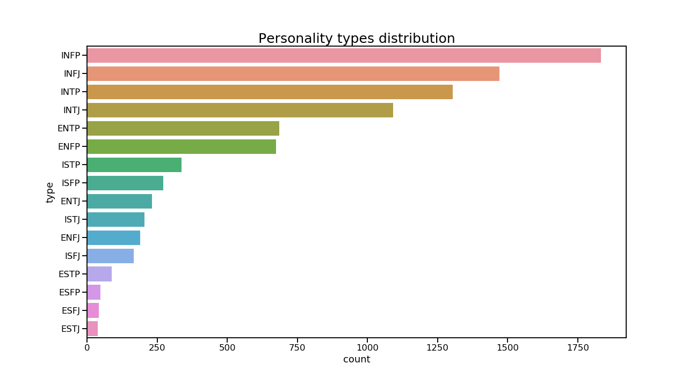
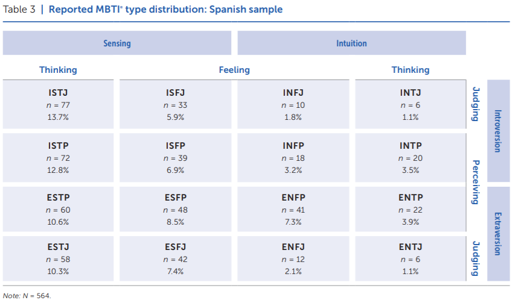
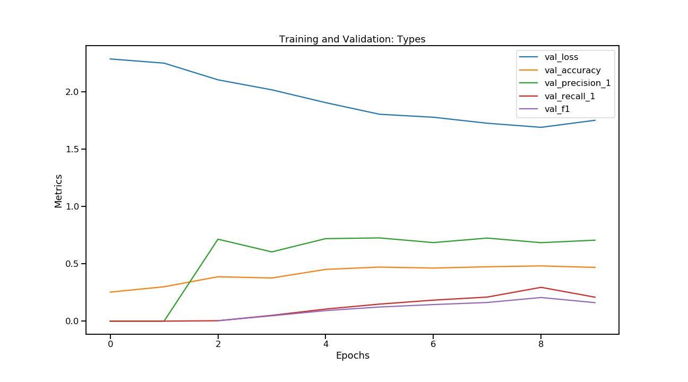
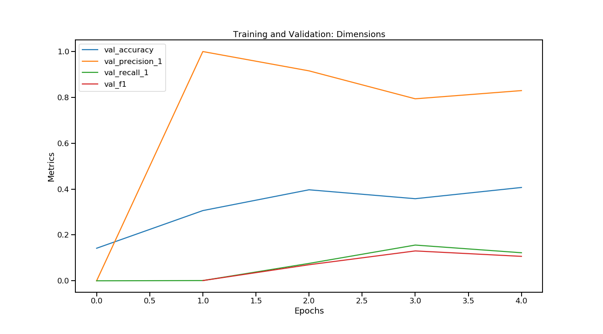
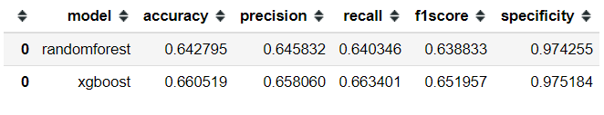

# Natural Language Processing to predict Myers-Briggs Personality Type
**Miguel García Melgar**

*Data Analytics Part-Time, Barcelona, Dec19*

## Content
- [Project Description](#project-description)
- [Objective](#objective)
- [Dataset](#dataset)
- [Workflow](#workflow)
  * [Exploratory Data Analysis](#exploratory-data-analysis)
  * [Preprocessing](#preprocessing)
  * [Model Training and Evaluation](#model-training-and-evaluation)
  * [Conclusion](#conclusion)
- [Future improvements](#future-improvements)
- [Tools and requirements](#tools-and-requirements)
- [Links](#links)

## Project Description
To learn more on NLP while applying its methods to psychological variables, I have been working on this dataset from Kaggle, [(MBTI) Myers-Briggs Personality Type Dataset](https://www.kaggle.com/datasnaek/mbti-type) which holds information on a forum's users' posts and personalities using MBTI.

## Objective
The IT labour market is getting more and more competitive, as there is more demand than professionals offer. And of course, everyone wants the best of the best for their company.

Finding the best talent and ensuring they culturally fit in their organizations means a lot of time, effort and money to invest in material, software and personality, intelligence and competency measures for Recruitment Teams; even when they have increasingly amounts of candidates' information.

I want to shorten recruitment times and costs in psychometric tests.

So starting with personality tests I pretend to train a model to use text we get from candidates (social networks, cover letters, CV, etc).

To sum up, in this project I want to train a **classification model using text data features and meta-features from each user comments, messages and posts to predict their personalities**.

## Dataset
I have been working on this dataset from Kaggle, [(MBTI) Myers-Briggs Personality Type Dataset](https://www.kaggle.com/datasnaek/mbti-type), that holds data collected through the [PersonalityCafe forum](http://personalitycafe.com/forum/), as it provides a large selection of people and their MBTI personality type, as well as what they have written. So I was working with only two variables, both of them being categorical, `type`(personality type code and my target) and `posts` (50 latest posts of each user).

## Workflow
### Exploratory Data Analysis
First off all, I checked how the data looked like as well as its shape, columns and dtypes. Then I confirmed there where no nulls or duplicates.

When I checked for unique values and target distribution I found out that in posts there was a unique value per entrance, and that the distribution was horribly unbalanced, especially considering distributions found by the original researchers and authors of this psychometric measure (MBTI).

Finally, I created a Bag of Words by tokenizing posts column using Spacy, so as to use them to create a word cloud and visualize text before starting cleaning it.

### Preprocessing
* I used SpaCy to clean and lemmatise the words from each post.
* Once cleaned I transformed the corpus of the text to a matrix using TfidfVectorizer.
* As the sparse matrix was quite big I tried on 3 different ways to reduce its dimensionality:
  * Using Truncated SVD with 100 components.
  * Using UMAP.
  * Using Truncated SVD and then UMAP on its results.
* Enclosing preprocessing, I encoded my target labels i two different ways. One would use all 16 types, and the other would rather focus on its 4 axes. Thereafter, I created 6 different datasets that I will use to train the models by combining each dimensionality reduction strategy which each kind of labelling the target variable. 

### Model Training and Evaluation
#### Machine Learning Models
From the 6 datasets mentioned above, I trained quite a few models by combining different algorithms for each dataset, and each target, but also with the original dataset size and also with resampled versions:
* The algorithms used were `GaussianNB`, `LogisticRegression`, `KNeighborsClassifier`, `DecisionTreeClassifier`, `RandomForestClassifier`, `GradientBoostingClassifier` and `MLPClassifier`.
* So using 7 models, 2 sample sizes, 5 different labels (type + 4 possible dimensions) and 3 dimensionality reduction methods, I ended up training 210 different models. 

* The table shows the results of training the different algorithms with the results from applying TSVD (100 components) to reduce the dimensionality of the types' dataset without resampling, as the best results were obtained from GraddientBoostingClassiffier using this particular sample.
#### Deep Learning Models

Before proceeding further with hyperparameters tuning of the ML models previously evalueted, I lets try with a combinatio nof unsupervised ML and DL.

I will use GloVe, an unsupervised learning algorithm for obtaining vector representations for words, altogether with a LSTM recurrent neural network to train two models, one for personality types and another one for dimensional trait axes.

As you can see the results are lower than the ones using Gradient Booster and Random Forest.

#### Fine tuning of the best models

### Conclusion

The model trained has an F1 Score of 0.651957, that is, this model can predict MBTI personality type 65,2% of times.

Despite not seeming particularly outstanding results, as a multiclass classification (16 types), randomness baseline was located at 6.25%. So predictions from this model would be more than 10 times more accurate than guessing.

## Future improvements
Future improvements would include further hyperparameter tuning, training the best couple of models using better-balanced samples and testing the resulting best model on a completely different sample.  

Ideally, I would also like to adapt it to the Big Five model, as is the personality models of the highest predictive validity. Still, adapting it/ doing a new similar model for predicting other psychological metrics out of text would be mesmerizing too.

## Tools and requirements
In order to train more models simultaneously, I've been both using Jupyter Notebooks on my own machine and also using default virtual machines with Google Colab.

I have also used the latest Conda  with the last version of the following packages and libraries:
* os
* pandas
* numpy
* scipy
* math
* random
* seaborn
* matplotlib
* PIL
* wordcloud
* re
* itertools
* spacy
* en_core_web_sm
* string
* collections
* pickle
* umap-learn
* yellowbrick
* sklearn 
* keras

## Links
[Repository](https://github.com/mikongame/NLP-to-predict-Myers-Briggs-Personality-Type)  

[Slides](https://drive.google.com/file/d/1yxGmtVNFPa4AZYL16zA0mP8AgQVconof/view?usp=sharing) 

[Presentation](https://youtu.be/1IOTOnmpWTI)
