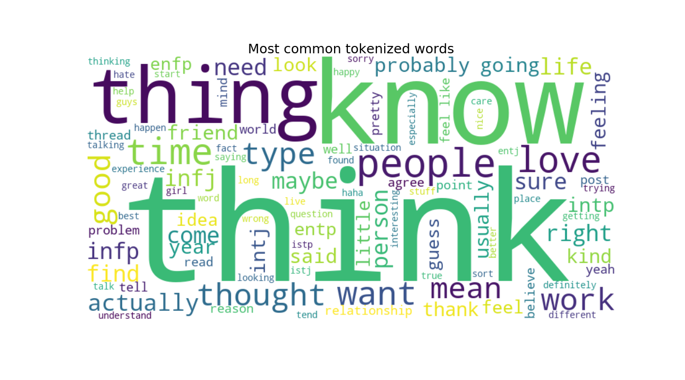

# NLP to predict Myers-Briggs Personality Type
*Miguel García Melgar*

*Data Analytics Part-Time, Barcelona, Dec19 *

## Content
- [Project Description](#project-description)
- [Objective](#objective)
- [Dataset](#dataset)
- [Workflow](#workflow)
  * [Exploratory Data Analysis](#exploratory-data-analysis)
  * [Preprocessing](#preprocessing)
  * [Model Training and Evaluation](#model-training-and-evaluation)
  * [Conclusion](#conclusion)
- [Future Work](#future-work)
- [Tools and requirements](#tools-and-requirements)
- [References](#references)

## Project Description
In order to learn more on NLP while applaying its methods to psychological variables I have been working on this dataset from Kaggle, [(MBTI) Myers-Briggs Personality Type Dataset](https://www.kaggle.com/datasnaek/mbti-type) which holds information on a forum's users' posts and personalities using MBTI.

## Objective
The IT labour market is getting more and more competitive, as there is more demmand than offer of proffesionals. And of course, eveywane wants the best of the best for their company.

Finding the best talent and ensuring they culturally fit in their organizations means a lot of time, effort and money to invest in material, softwere and personality, intelligence and competency measures for Recruitment Teams; even when they have increasingly amount sof candidates' information.

I want to shorten recruitment times and costs in psichometric tests.

So starting with personality tests I pretend to train a model to use text we get from candidates (social networks, cover letters, CV, etc).

To sum up, in this project I want to train a **classification model using text data features and meta-features from each user comments, messages and posts to predict their personalities**.

## Dataset
I have been working on this dataset from Kaggle, [(MBTI) Myers-Briggs Personality Type Dataset](https://www.kaggle.com/datasnaek/mbti-type), that holds data collected through the [PersonalityCafe forum](http://personalitycafe.com/forum/), as it provides a large selection of people and their MBTI personality type, as well as what they have written. So I was working with only two variables, both of them being categorical, `type`(personality type code and my target) and `posts` (50 latest posts of each user).

## Workflow
### Exploratory Data Analysis
First off all I checked how the data looked like as well as it's shape, columns and dtypes. Then I confirmed there where no nulls or duplicates.

When I checked for unique values and target distribution i found out that in posts there was a unique value per entrance, and tha tthe distribution was horribly unbalanced, specially considering distribuitions found by the original researchers and authors of this psychometric measure (MBTI).

Finally I created a Bag of Words by tokenizing posts column using Spacy, so as to use them to create a wordcloud and visualize text before starting cleaning it.

### Preprocessing
* I used SpaCy to clean and lemmatise the words from each post.
* Once cleaned I transformed the corpus of the text to a matrix using TfidfVectorizer.
* As the sparse matrix was quite big I tried on 3 different ways to reduce its dimensionality:
  * Using Truncated SVD with 100 componets.
  * Using UMAP.
  * Using Truncated SVD and then UMAP on its results.
* Enclosing preprocessing, I encoded my target labels i two different ways. One would use all 16 types, and the other would rather focus on its 4 axes. Thereafter, I created 6 different datasets that I will use to train the models by combining each dimensionality reduction strategy which each kind of labeling the target variable. 

### Model Training and Evaluation
#### Machine Learning Models
*Include this section only if you chose to include ML in your project.*
* Describe how you trained your model, the results you obtained, and how you evaluated those results.
#### Deep Learning Models
#### Fine tuning of the best model

### Conclusion
* Summarize your results. What do they mean?
* What can you say about your hypotheses?
* Interpret your findings in terms of the questions you try to answer.

## Future Work
Address any questions you were unable to answer, or any next steps or future extensions to your project.

## Tools and requirements
In order to train more models simultaneously I've been both using Jupyter Notebooks thorught my own machine and also using default virtual machines throught Google Colab.

I have also used the latest Conda  with the last version of the following packages and libraries:
* os
* pandas
* numpy
* scipy
* math
* random
* seaborn
* matplotlib
* PIL
* wordcloud
* re
* itertools
* spacy
* en_core_web_sm
* string
* collections
* pickle
* umap-learn
* yellowbrick
* sklearn 

## Links
[Repository](https://github.com/mikongame/NLP-to-predict-Myers-Briggs-Personality-Type)  
[Slides](https://drive.google.com/file/d/1rZ-PFzKa57yAYabTOZBMwIlvb0hK7zHN/view?usp=sharing)  
